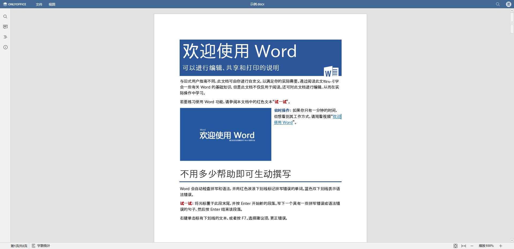
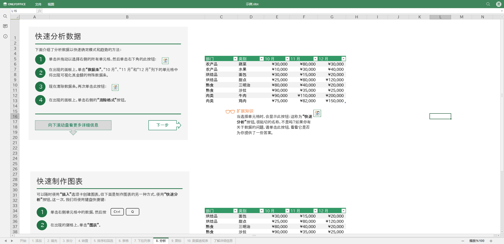
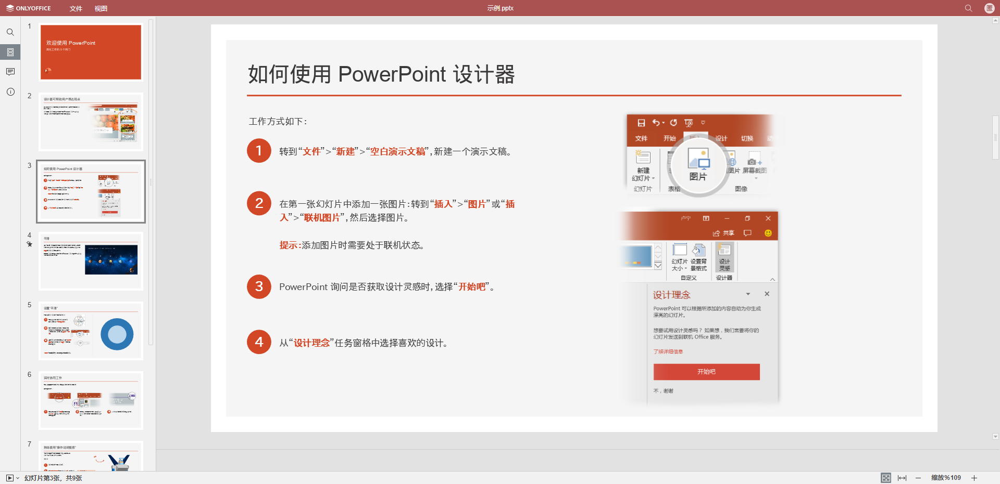
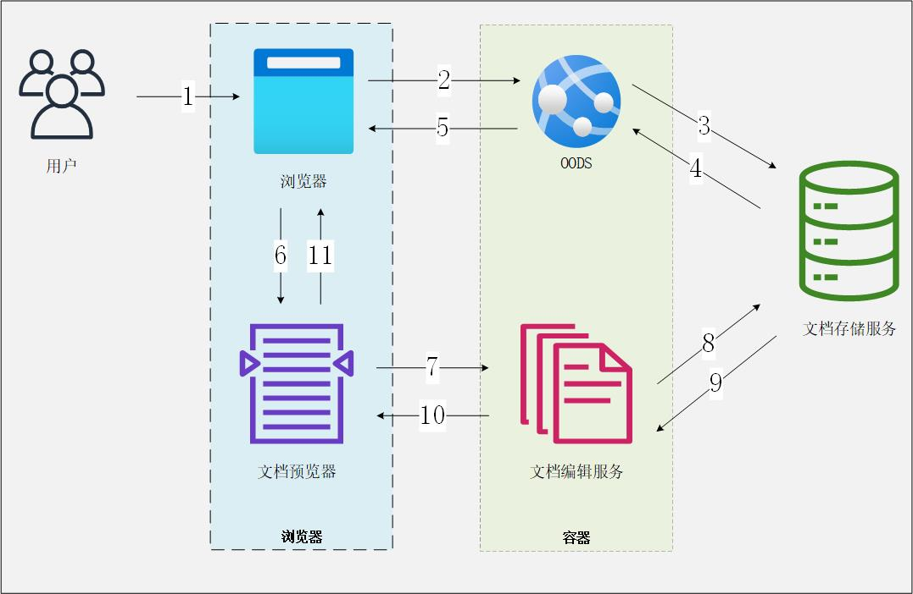

<h3 align="center">文档在线预览服务</h3>
<h4 align="center">基于OnlyOffice</h4>

## 项目简介

`OnlyOffice` 是一款强大的在线编辑器，提供文本文档、电子表格、演示文稿、表单和PDF查看器和编辑器。  
本项目(下文简称为 `OODS` )仅使用 `OnlyOffice` 的在线预览功能，提供文本文档、电子表格、演示文稿的在线预览。
本项目同时提供http和https支持。  

`OODS` 支持预览的文件类型：
*   ***文本文档***：doc、docm、docx、docxf、dot、dotm、dotx、epub、fodt、fb2、htm、html、mht、odt、oform、ott、oxps、pdf、rtf、txt、djvu、xml、xps; 
*   ***电子表格***：csv、fods、ods、ots、xls、xlsm、xlsx、xlsb、xlt、xltm、xltx; 
*   ***演示文稿***：fodp、odp、otp、pot、potm、potx、pps、ppsm、ppsx、ppt、pptm、pptx; 

### 页面样例

##### ***文本文档***



##### ***电子表格***



##### ***演示文稿***



## 前置条件

### 文档存储服务
需自行搭建文档存储服务，并提供如下接口

#### ***1、获取文件信息***

**接口地址**: `/api/file/info` (可自行定义)   

**请求方式**: `GET`

**请求数据类型**: `application/json`

**响应数据类型**: `*/*`

**接口描述**: 提供文件基本信息，用于文件缓存判断及信息展示  

**请求参数**:

| 参数名称   | 参数说明 | 请求类型  | 是否必须 | 数据类型   | schema |
|--------|------|-------|------|--------|--------|
| fileId | 文件编号 | query | true | string |        |

**响应参数**:

| 参数名称         | 参数说明             | 类型     | schema |
|--------------|------------------|--------|--------| 
| BaseFileName | 文件名称，用于文件名展示     | string |        |
| SHA256       | 文件SHA256值，用于文件缓存 | string |        |

**响应示例**:

```javascript
{
    "BaseFileName": "示例.xls",
    "SHA256": "scYue7g0IQQrdvxV6SRjfK0QRqOrVg+3NKuKj6M5mvk="
}
```

#### ***2、获取文件流***

**接口地址**: `/api/file/download` (可自行定义) 

**请求方式**: `GET`

**请求数据类型**: `application/x-www-form-urlencoded`

**响应数据类型**: `*/*`

**接口描述**: 用于下载需要预览的文件  
**请求参数**:  

| 参数名称   | 参数说明 | 请求类型  | 是否必须 | 数据类型   | schema |
|--------|------|-------|------|--------|--------|
| fileId | 文件编号 | query | true | string |        |

**实现示例**:

```python
# django
@api_view(['GET'])
@permission_classes([permissions.AllowAny])
def get_file(request):
    file_id = request.query_params['fileId']
    document = Document.objects.filter(uuid=file_id).first()
    if document:
        path = document.file.path
        return FileResponse(open(path, 'rb'), filename=document.name)
    return Response()
```

## 项目架构



01. 用户在浏览器中打开`文档预览器`；
02. 浏览器向`OODS`应用请求页面内容；
03. `OODS`应用接收并解析请求，提取参数后向外部`文档存储服务`请求文件基本信息；
04. 外部`文档存储服务`处理请求参数，并返回对应文件信息；
05. `OODS`应用处理文档信息和Onlyoffice服务配置信息，渲染并返回页面给浏览器；
06. 浏览器渲染`文档预览器`；
07. `文档预览器`向`文档编辑服务`请求文档内容；
08. `文档编辑服务`使用`文档预览器`提供的文档数据从外部`文档存储服务`/缓存中获取文档文件；
09. `文档存储服务`/缓存向`文档编辑服务`提供文档文件；
10. 文件准备就绪后，`文档编辑服务`将其转换为Office Open XML 格式，并将文档文件传输到基于浏览器的`文档预览器`；
11. `文档预览器`在浏览器中显示文档文件。

## 快速开始

### 一键部署

```sh
[root@localhost ~]# cd oods # 进入工作目录
[root@localhost oods]# sh build.sh # 构建镜像
[root@localhost oods]# docker-compose up -d # 启动服务
```

**docker环境变量说明**  

* FILE_CACHE_TIME: 文件缓存保留时间，单位为秒，默认值为`86400`
* HTTP_OODS_PORT: 提供http服务的端口，默认值为`80`
* HTTPS_OODS_PORT: 提供https服务的端口，默认值为`443`  

***备注***：端口参数需与实际提供服务的IP上的端口保持一致；如使用容器自身IP提供服务，应保持默认值不变；如使用宿主机提供服务，应与docker容器映射至宿主机的端口保持一致

### 页面路径  
***路径结构***：
http://${host}/view/  

**支持的路径参数如下表所示**：  

| 参数名称            | 参数说明                                   | 请求类型  | 是否必须 | 数据类型   | 默认值                | 示例                    |
|-----------------|----------------------------------------|-------|------|--------|--------------------|-----------------------|
| lang            | 语言(en, de, ru, it, etc.)               | query | true | string | zh                 | zh                    |
| host            | 文档存储服务host                             | query | true | string | /                  | http://127.0.0.1:8000 |
| oods            | onlyoffice服务host，http(s)协议应与oods服务保持一致 | query | true | string | /                  | http://127.0.0.1:9080 |
| fileId          | 文件编号                                   | query | true | string | /                  | 065f62f9              |
| getFileInfo     | 获取文件信息接口路径                             | query | true | string | /api/file/info     | /                     |
| downloadFile    | 获取文件流接口路径                              | query | true | string | /api/file/download | /                     |
| HTTP_OODS_PORT  | oods提供http服务的端口                        | query | true | string | 80                 | 9080                  |
| HTTPS_OODS_PORT | oods提供https服务的端口                       | query | true | string | 443                | 9443                  |

***路径示例：***
http://192.168.1.228:9080/view/?host=http://10.100.1.250:8000&getFileInfo=/get_file_info/&downloadFile=/get_file/&fileId=ade02e5b-8d6d-4f7d-8ca7-b8a9e3d5c183

## 技术栈

*   前端：[Django](https://www.djangoproject.com/)
*   后端：[Django](https://www.djangoproject.com/)
*   部署：[Docker](https://www.docker.com/)

## 参考文档

* [Onlyoffice官方docker文件仓库](https://github.com/ONLYOFFICE/Docker-DocumentServer/tree/v7.3.0.187)
* [Onlyoffice说明文档](https://api.onlyoffice.com/zh/editors/basic)
* [Onlyoffice配置文件参数说明](https://helpcenter.onlyoffice.com/installation/docs-developer-configuring.aspx)
* [Onlyoffice编辑器配置文件参数说明](https://api.onlyoffice.com/zh/editors/config/)
* [修改onlyoffice缓存配置](https://www.cmdschool.org/archives/16850)
* [修改OnlyOffice的连接数限制](https://blog.csdn.net/xm393392625/article/details/86525081)
